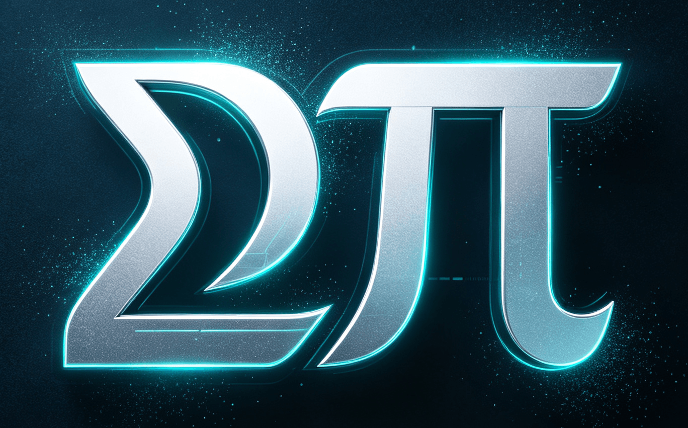

# SigPi

<p align="center">
  
</p>

> **一个真正能读懂的、开源的编程智能体（coding agent）。**  
> 用 TypeScript 编写，在终端里运行，兼容任何 OpenAI 兼容接口的 LLM。

SigPi 类似于 Claude Code 或 Codex CLI——它能读取你的代码库、编辑文件、运行 shell 命令，并管理多轮会话。区别在于：**每一行代码都是为了让人读懂而写的**。没有框架魔法，没有庞大的抽象层。如果你曾经好奇编程智能体内部到底是怎么工作的，你可以直接打开源码，从 `cli.ts` 一路跟到 agent 主循环。

SigPi 的设计灵感来自 [Pi](https://github.com/earendil-works/pi)，它的终端 UI 基于同一个项目的 `pi-tui` TUI 包。

---

## 它能做什么

| | |
|---|---|
| 💬 **和 LLM 聊你的代码** | 带会话持久化的交互式 REPL |
| 🔍 **搜索与导航** | 内置 grep、glob 和文件读取工具，agent 可自主使用 |
| ✏️ **编辑文件** | 精确字符串替换 + 整文件写入 |
| ⚡ **运行 shell 命令** | 带超时、后台任务和输出流式传输的 Bash |
| 🧠 **多轮记忆** | 会话在重启后依然保留；长对话会自动摘要以适配上下文窗口 |
| 🎯 **计划跟踪** | agent 跟踪多步骤任务，让你一眼看到进度 |

---

## 快速开始

```bash
# 1. 安装
git clone https://github.com/xiatianliang1024gm/sigpi
cd sigpi
pnpm install

# 2. 配置
pnpm dev init
# 编辑 ~/.sigpi/config.toml，填入你的 API key 和模型

# 3. 开始聊天
pnpm dev chat
```

就这样，你已经在和一个能看懂你代码的 agent 对话了。

```bash
# 恢复之前的会话
pnpm dev chat --session <id>
```

---

## 为什么用 SigPi？

**它是参考实现，不是黑盒。** 大多数编程智能体一层套一层框架，直到核心循环被彻底埋没。SigPi 把 agent 主循环、工具调用和上下文管理都摆在明面上。如果你自己在构建 agent，或者只是想弄明白它们是怎么运作的，这个项目就是为你准备的。

- **依赖极少** —— 只有 OpenAI SDK、一个 TOML 解析器和一个终端 UI 库
- **约 60 个源文件** —— 小到一个下午就能读完
- **阅读路径** —— 从 [AGENTS.md](./AGENTS.md) 开始了解关键入口，再看 [CONTEXT-MAP.md](./CONTEXT-MAP.md) 了解统一语言（ubiquitous language）

---

## 环境要求

- **Node.js ≥ 22.19.0**
- **pnpm**

---

## 配置

SigPi 兼容任何支持 OpenAI chat completions API 的提供商（OpenAI、通过代理的 Anthropic、Ollama、LiteLLM 等）。

```toml
# ~/.sigpi/config.toml
[models.default]
base_url = "https://api.deepseek.com"
api_key  = "sk-..."
name     = "deepseek-v4-flash"
```

覆盖方式：项目里的 `.sigpi/config.toml`，或环境变量。

---

## 更多

- **会话**：`pnpm dev session new --title "fix login bug"` / `pnpm dev session list`
- **聊天内命令**：`/summary`、`/compact`、`/resume`、`/model`
- **技能（Skills）**：把一个 `SKILL.md` 放进 `.sigpi/skills/`，agent 会自动加载。遵循 [Agent Skills 规范](https://agentskills.io/specification)。
- **日志**：`~/.sigpi/logs/agent.log`，按天轮转

---

## 许可证

MIT。见 [LICENSE](./LICENSE)。
